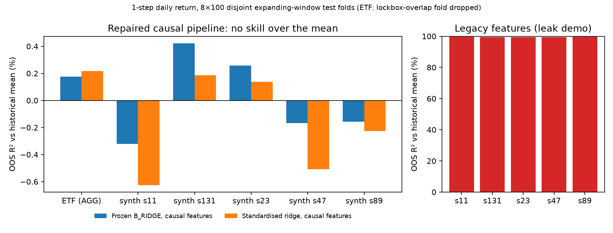

# Final Research Report (internal)

**Workspace:** `/Volumes/PRO-BLADE/Wharton-Experiments`
**Revised:** 2026-09-27 (integrity audit; supersedes the 2026-09-26 version)
**Status:** Legacy lean matrix complete (1181/1181) but **leakage-contaminated**. Lockbox opened once; H1 not supported on valid evidence. Repaired exploratory pipeline: **no forecasting skill over the historical mean**. Client IPS still BLOCKED.

## 1. Summary

The 2026-09-26 report selected a ridge forecast after it "clearly beat persistence" on a virgin synthetic lockbox. That result is an artefact: the synthetic features contain the contemporaneous driver of the label (D-050). After repairing the data path (causal features, genuinely disjoint folds), neither the frozen ridge nor a standardised ridge beats the historical mean on real ETF data or on any synthetic seed. Beating random-walk persistence is uninformative, because any forecast shrunk toward zero does so. The defensible decision is to **not rely on return forecasts**: use a strategic allocation with EWMA risk sizing and an operating-cash reserve.

Distinctions: implemented ≠ validated ≠ investable; lockbox ≠ funding guarantee; proposed trade ≠ WInS execution.

## 2. Evidence generations

| Generation | Label | Use |
|---|---|---|
| Pre-lean receipts (1916 orphans under `runs/`) | historical / superseded | Excluded from all tables (D-055) |
| Lean matrix, 1181 cells (`protocol/EXPERIMENT_MANIFEST.csv`) | leakage-contaminated | Engineering smoke evidence only |
| Lockbox, single open (`runs/lockbox/`) | preregistered, frozen | Synthetic arm invalid; ETF arm negative |
| Factorial (`runs/factorial/`) | invalid (look-ahead, forecast unused) | Provenance only (D-054) |
| Repaired pipeline (`runs/repaired/`) | exploratory, post-lockbox | Current best evidence; not confirmatory |

## 3. Defects found in the legacy pipeline

1. **Synthetic leak (D-050).** Track C features `[latent_t, latent_{t-1}]`, label `β·latent_t + ε`, ε ~ N(0, 0.01²). Ridge recovers the label up to noise: lockbox MSE 9.89e-5 ≈ 1e-4 = Var(ε).
2. **ETF leak (D-051).** Expanding-std feature at row t includes r_t. Every tabular "h20" label is actually a 1-step return.
3. **Degenerate replication (D-052).** All legacy folds share one split at lean sizes, and ETF seeds share one panel. In the full profile each model has 1 distinct ETF value and ≤ 5 distinct synthetic values across 20 cells. "Validation folds 0–2" are the same split as full fold 3.
4. **Mislabelled target (D-053).** ETF asset 0 is AGG (bond ETF), not SPY.
5. **Mixed generations (D-055).** Scoreboards previously averaged 1916 orphan receipts into the full profile (n=120 per model vs 40 in the manifest).

## 4. Legacy results with corrected status

Selection rule (preregistered): min pooled MSE, prefer B_RIDGE within 1%. M04 5.356e-05, B_RIDGE 5.365e-05. Selection stands as a recorded decision, but it is **not evidence of skill** (pooled MSE is dominated by the leaky synthetic track, and the folds are not distinct).

| Lockbox dataset | B_RIDGE MSE | Persistence MSE | Status |
|---|---:|---:|---|
| synthetic seed 997 | 9.89e-05 | 0.0281 | INVALID — leakage |
| ETF offset 800 (AGG) | 2.14e-05 | 2.12e-05 | NEGATIVE — ridge not better |

- H1: not supported on valid evidence. H2 (finite EWMA Frobenius error): true but trivial.
- Multiplicity over the legacy full profile (Wilcoxon vs persistence, BH): after collapsing duplicate cells, **0/10 comparisons are testable** (ETF 1 unique pair, synthetic 5). `reports/evidence_bank/MULTIPLICITY_SUMMARY.md`.
- M11 `funding_shortfall` is 0.0 in every cell (the obligation never binds), so it is uninformative.

## 5. Repaired exploratory evaluation (D-056)

Setup: label = next-day return of asset 0. Causal features: lag-1 return, 5-day mean, 20-day std, and lag-1 cross-sectional mean, all computed from rows < t. Folds: expanding window, 8 × 100 disjoint test rows, minimum 300 training rows. ETF: 1691-row cache (sha256 `6c234590…`); the one fold overlapping lockbox rows [800, 960) is dropped, leaving 700 test days. Synthetic: SIGNAL world, frozen full seeds {11, 23, 47, 89, 131}, 1200 steps, 800 test days each. Statistics: Diebold–Mariano (Newey–West) on squared-error differentials, BH over the 48-test challenger family, and a fold-level Wilcoxon. Git HEAD at run: `2b14666`.

Pre-declared primary contrast, standardised ridge vs historical mean (OOS R² = 1 − MSE_ridge / MSE_mean):

| Dataset | OOS R² | DM p | BH q |
|---|---:|---:|---:|
| ETF (AGG) | +0.22% | 0.742 | 0.810 |
| synthetic s11 | −0.62% | 0.221 | 0.342 |
| synthetic s23 | +0.14% | 0.848 | 0.884 |
| synthetic s47 | −0.51% | 0.117 | 0.224 |
| synthetic s89 | −0.23% | 0.621 | 0.753 |
| synthetic s131 | +0.19% | 0.681 | 0.765 |

- No ridge-vs-mean or ridge-vs-zero contrast is significant after BH (0/24).
- Ridge vs 1-step persistence: OOS R² +46% to +50% on every dataset (q < 1e-20). This reflects the weakness of persistence (for near-i.i.d. returns its MSE ≈ 2 × variance), not skill.
- Leakage demonstration: the frozen B_RIDGE on legacy features over the same test rows gets OOS R² ≈ +99.5% on every seed.
- The frozen B_RIDGE (unstandardised, α = 1, no intercept) is numerically close to a zero forecast on return-scale features.



Figure: `scripts/figures/repaired_oos_r2.py`; source data `reports/figures/repaired_oos_r2.csv`. Full tables: `reports/evidence_bank/REPAIRED_EVAL_SUMMARY.md`.

## 6. Limitations

- The repaired evaluation is post-lockbox and exploratory. ETF training windows include rows that were in the spent lockbox window (test windows exclude them).
- Only tabular baselines were re-evaluated. M01–M12 were **NOT RUN** on the repaired pipeline, so the legacy ranking of complex models is unsupported either way.
- The synthetic SIGNAL world has an i.i.d. latent, so no causal predictability exists by construction. It validates the pipeline (no spurious skill), not a forecasting method.
- The ETF cache is not versioned in git. A fresh download will differ (see `data/manifests/DATA_MANIFEST.yaml`).
- The target is a single asset (AGG) at a 1-step horizon. There are no transaction costs in the forecasting evaluation.

## 7. Blocked

WGY case PDFs, WInS executions, client wealth/obligations, Track B point-in-time data, submission authority.

## 8. Reproduce

```bash
bash scripts/bootstrap.sh
PYTHONPATH=src .venv/bin/python scripts/run_repaired_eval.py
PYTHONPATH=src .venv/bin/python scripts/run_multiplicity.py
.venv/bin/python scripts/figures/repaired_oos_r2.py
bash scripts/build_reports.sh && .venv/bin/python scripts/build_evidence_bank.py
.venv/bin/python scripts/build_pdfs.py
```
